<div align="center">


<h1>Digital Experience Monitoring</h1>

<p><strong>The Enterprise Standard for Measuring and Optimizing End-User Experience</strong></p>

[]()
[]()
[]()
[]()

<br/>

> **"A digital experience is the heartbeat of a modern brand."** 
> Digital Experience Monitoring (DEM) is a flagship repository designed to enable organizations to measure, optimize, and operationalize end-user experience across web, mobile, and APIs through industrialized monitoring and analytics.

</div>

---

## 🏛️ Executive Summary

**Digital Experience Monitoring** is a flagship repository designed for Chief Technology Officers (CTOs), SRE Teams, and Product Leaders. In a world where every millisecond counts, the ability to quantify and improve the digital journey is the ultimate competitive advantage.

This platform provides an industrialized approach to **Digital Experience**, delivering production-ready **Real User Monitoring (RUM)**, **Synthetic Probes**, **API Experience Analytics**, and **Global Performance Benchmarks**. It supports **Azure**, **AWS**, **GCP**, and **Kubernetes**, enabling organizations to transition from "Reactive Ops" to "Experience-First Engineering."

---

## 💡 Why Digital Experience Matters

Customer loyalty is earned through performance and reliability:
- **Revenue Correlation**: Understanding how latency impacts conversion rates and total business value.
- **Brand Reputation**: Recognizing that a poor digital experience is a direct threat to brand equity.
- **SRE & SLOs**: Centering reliability around the actual end-user experience rather than just infrastructure health.
- **Employee Productivity**: Measuring the effectiveness of internal portals and SaaS platforms for the workforce.

---

## 🚀 Business Outcomes

### 🎯 Strategic Experience Impact
- **Optimized Conversions**: Identifying and fixing "Rage Clicks" and journey drop-offs in real-time.
- **Proactive Resolution**: Using synthetics to detect failures before users are impacted.
- **Evidence-Based Design**: Guiding product roadmaps using actual performance data (Core Web Vitals).
- **Reduced Support Burden**: Correlating experience degradations with support ticket volume to automate incident response.

---

## 🏗️ Technical Stack

| Layer | Technology | Rationale |
|---|---|---|
| **Analytics Engine** | Python, Pandas, NumPy | High-performance processing of RUM events, journey paths, and anomaly detection. |
| **Control Plane** | FastAPI | High-performance API for request management and monitoring orchestration. |
| **Frontend** | React 18, Vite | Premium portal for executive dashboards, journey analytics, and performance heatmaps. |
| **IaC Foundation** | Terraform | Multi-cloud infrastructure consistency and experience foundation automation. |
| **Database** | PostgreSQL | Centralized repository for platform metadata, alert state, and history. |
| **Observability** | Prometheus / Grafana | Real-time monitoring of ingest pipelines, synthetic runners, and system health. |

---

## 📐 Architecture Storytelling: 70+ Diagrams

### 1. Executive High-Level Architecture
The holistic vision of the enterprise digital experience journey.

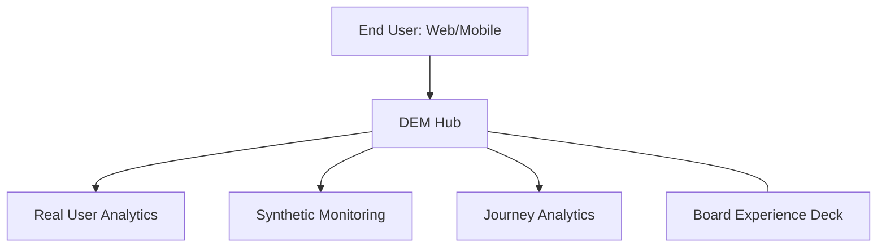

### 2. Detailed Component Topology
The internal service boundaries and management layers of the platform.

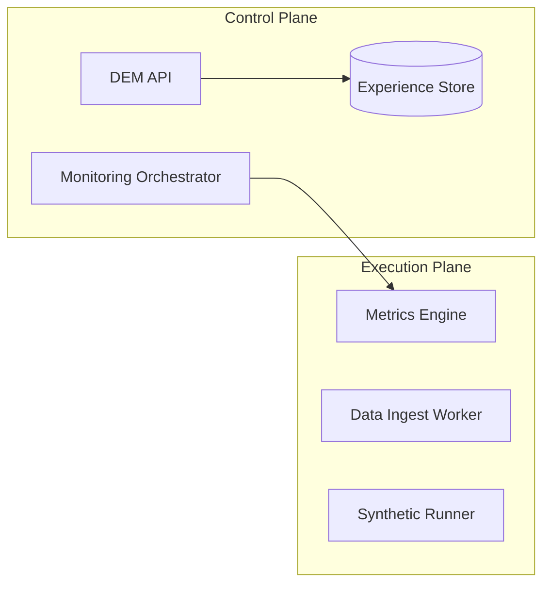

### 3. End User to Backend Request Path
Tracing a RUM event from the browser through the industrialized analytics stack.

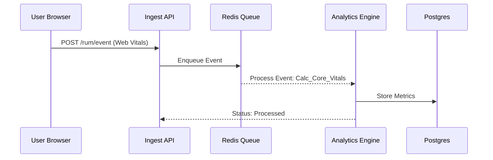

### 4. Monitoring Control Plane
The "Brain" of the framework managing global experience definitions.

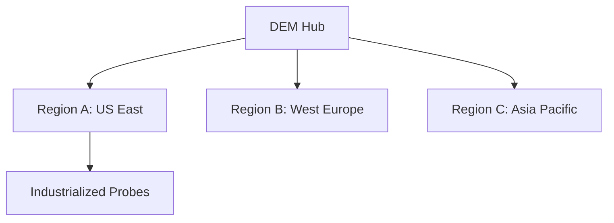

### 5. Multi-Cloud Topology
Synchronizing experience standards across Azure, AWS, and GCP.

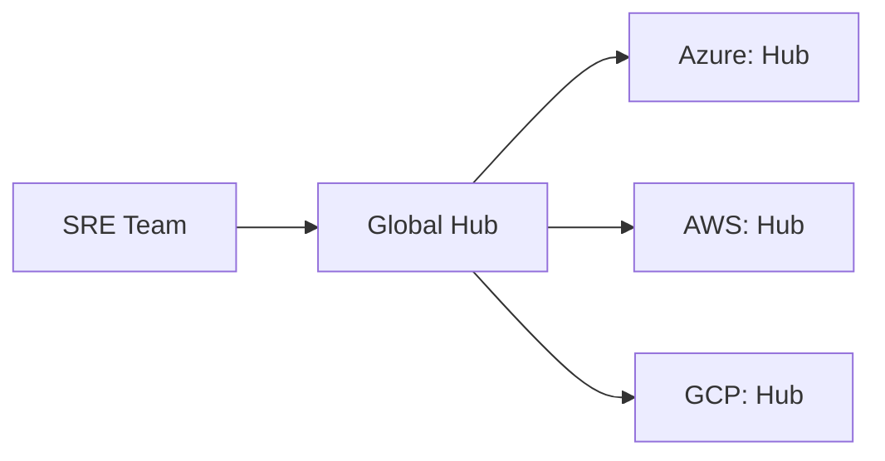

### 6. Regional Deployment Model
Hosting ingestion and runners close to the users for performance.

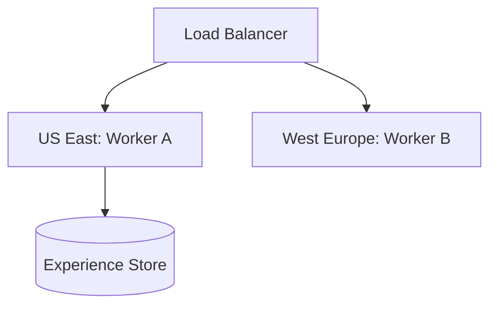

### 7. DR Failover Model
Ensuring monitoring continuity during regional cloud outages.

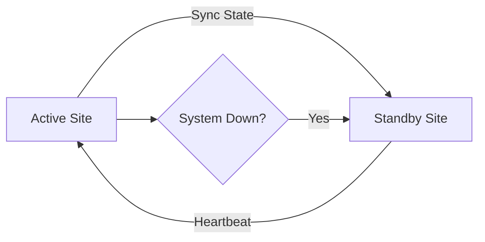

### 8. API Gateway Architecture
Securing and throttling the entry point for experience orchestration.

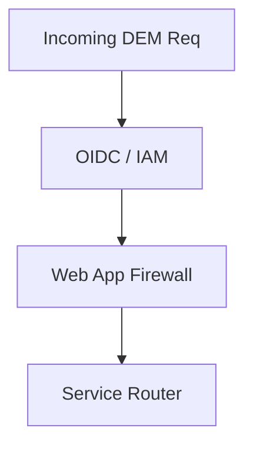

### 9. Queue Worker Architecture
Managing long-running data ingest and scoring tasks at scale.

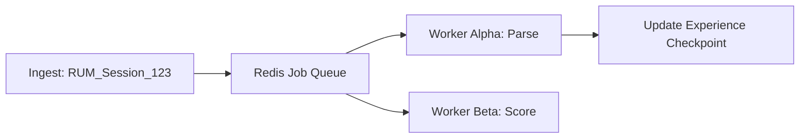

### 10. Dashboard Analytics Flow
How raw experience telemetry becomes executive engineering scorecards.

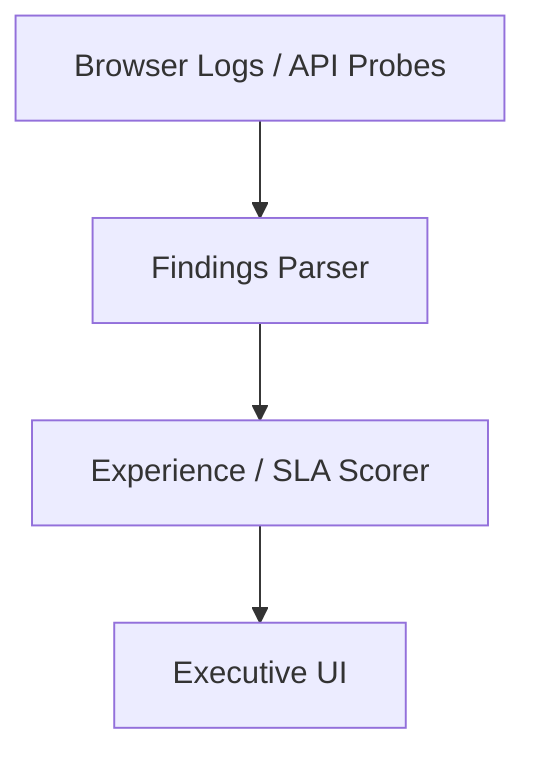

### 11. Browser SDK Event Flow
The lifecycle of a RUM event from user interaction to ingestion.

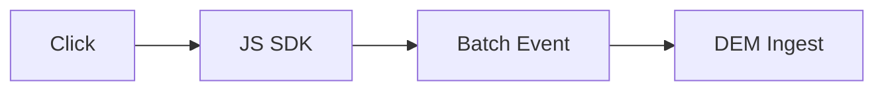

### 12. Core Web Vitals Pipeline
Automated tracking of LCP, FID, and CLS across all user sessions.

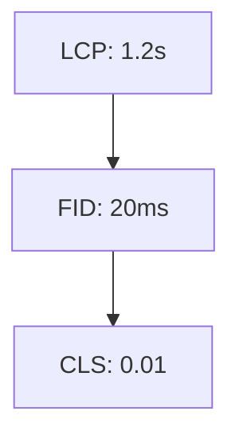

### 13. Session replay metadata flow
Capturing user interactions for diagnostic playback without compromising PII.

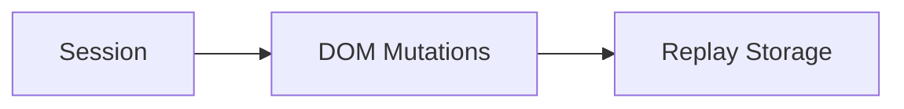

### 14. Error Capture Workflow
Automatically identifying and alerting on JS errors and failed API requests.

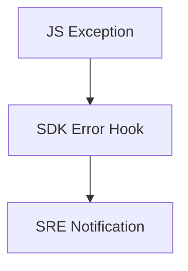

### 15. Page Load Waterfall Model
Visualizing the stages of page delivery from DNS to Full Load.

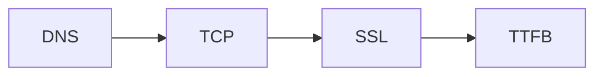

### 16. Geo Latency Heatmap
Mapping end-user performance across global regions.

```mermaid
graph TD
    US[US East: 45ms] vs Asia[Tokyo: 120ms]
```

### 17. Device Performance Segmentation
Comparing experience across Mobile, Desktop, and Tablet.

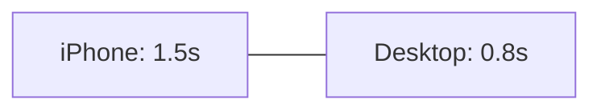

### 18. Browser Compatibility Analytics
Identifying performance regressions specific to browser versions.

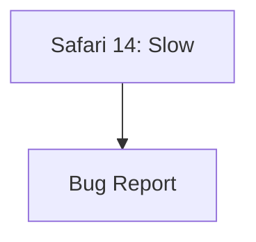

### 19. Conversion Funnel Model
Correlating performance with the completion of business goals.

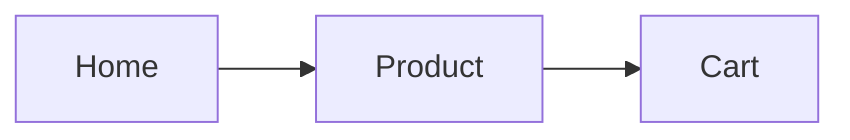

### 20. Rage click detection workflow
Identifying user frustration through repetitive, rapid interaction patterns.

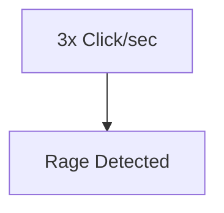

### 21. Synthetic Probe Workflow
Running automated, scheduled checks against global endpoints.

```mermaid
graph LR
    Sched[Schedule] --> Runner[Probe Runner]
    Runner --> Check[HTTP / Browser]
```

### 22. Multi-region check topology
Validating global availability from multiple cloud vantage points.

```mermaid
graph TD
    Probe_A[AWS: US] --> App[App]
    Probe_B[Azure: EU] --> App
```

### 23. API Latency Monitoring Flow
Measuring the health and response time of critical backend services.

```mermaid
graph LR
    Probe[Probe] --> API_G[Gateway] --> Service[Svc]
```

### 24. TLS Certificate Expiry Model
Proactively alerting on upcoming certificate expirations.

```mermaid
graph TD
    Check[Check Cert] --> Expire[30 Days Left]
```

### 25. Login Journey Synthetic Test
Automating the validation of the critical user authentication path.

```mermaid
graph LR
    Creds[Creds] --> Login[Login Page] --> Success[Home]
```

### 26. Checkout Flow Validation
Ensuring the revenue-generating path is always operational.

```mermaid
graph TD
    Cart[Cart] --> Pay[Payment] --> Conf[Confirm]
```

### 27. DNS Failure Detection
Identifying global DNS propagation issues or outages.

```mermaid
graph LR
    Resolver[Resolver] --> Error[NXDOMAIN]
```

### 28. CDN Performance Comparison
Benchmarking different CDN providers or edge locations.

```mermaid
graph TD
    Edge_A[Akamai: 12ms] vs Edge_B[CF: 15ms]
```

### 29. Third-party dependency checks
Monitoring the impact of 3rd party scripts on page performance.

```mermaid
graph LR
    App[App] --> Script[Tag Manager / Ads]
```

### 30. Scheduled Canary Monitoring
Running light synthetics against production for constant health checks.

```mermaid
graph TD
    Tick[Every 1m] --> Pulse[Pulse Check]
```

### 31. Mobile Crash Analytics Flow
Capturing and aggregating native app exceptions and ANRs.

```mermaid
graph LR
    Crash[Crash] --> Symbol[Symbolicate] --> Group[Group]
```

### 32. App Startup Performance Model
Measuring "Time to Interactive" for mobile application launches.

```mermaid
graph TD
    Launch[Launch] --> Main[Main UI Ready]
```

### 33. Network Failure Analytics
Identifying patterns in mobile network errors (4xx, 5xx, timeouts).

```mermaid
graph LR
    Request[Req] --> Fail[Connection Reset]
```

### 34. User Journey Drop-off Workflow
Analyzing where mobile users abandon the application.

```mermaid
graph TD
    ScreenA[A] --> ScreenB[B] --> Exit[Exit]
```

### 35. Feature Adoption Telemetry
Tracking the usage of new mobile features post-release.

```mermaid
graph LR
    Feature[New UI] --> Usage[Count]
```

### 36. Release Regression Detection
Comparing performance metrics between mobile app versions.

```mermaid
graph TD
    v1.0[v1.0: Fast] vs v1.1[v1.1: Slow]
```

### 37. Push Notification Impact Model
Measuring how push alerts drive user re-engagement.

```mermaid
graph LR
    Push[Push] --> Open[App Open]
```

### 38. Offline Sync Experience Flow
Monitoring the performance of background data synchronization.

```mermaid
graph TD
    Sync[Sync] --> Complete[1.2s]
```

### 39. Session Retention Lifecycle
Tracking how long users stay active within the mobile app.

```mermaid
graph LR
    Start[Start] --> End[End: 4.5m]
```

### 40. Product Usage Heatmap
Visualizing the most frequently interacted areas of the mobile UI.

```mermaid
graph TD
    Top[Top Nav: High] --> Bottom[Footer: Low]
```

### 41. SLO Error Budget Model
Managing reliability targets through the lens of the user experience.

```mermaid
graph LR
    SLO[99.9%] --> Budget[0.1% Burn]
```

### 42. Incident Escalation Workflow
Automatically routing experience alerts to the right on-call team.

```mermaid
graph TD
    Alert[RUM Failure] --> Pager[PagerDuty]
```

### 43. Alert Routing Lifecycle
Filtering and deduplicating alerts before human notification.

```mermaid
graph LR
    Signal[Alert] --> Filter[De-Dupe] --> Route[Slack]
```

### 44. Metrics Pipeline
The internal monitoring of the DEM platform itself.

```mermaid
graph TD
    Hub[DEM Hub] --> Prom[Prometheus]
```

### 45. Logging Architecture
Centralized logging for platform troubleshooting and analysis.

```mermaid
graph LR
    Ingest[Ingest] --> Loki[Grafana Loki]
```

### 46. Tracing Model
Tracing distributed experience requests through the platform.

```mermaid
graph TD
    Step1[Ingest] --> Step2[Analyze]
```

### 47. Capacity Planning Workflow
Predicting future platform needs based on user growth.

```mermaid
graph LR
    Trend[Growth] --> Forecast[Scale Ingest]
```

### 48. Autoscaling Decision Model
Triggering platform scale-out based on ingest lag or latency.

```mermaid
graph TD
    Lag[Lag > 5s] --> Scale[Add Workers]
```

### 49. Release Pipeline Correlation
Correlating experience changes with internal CI/CD deployments.

```mermaid
graph LR
    Deploy[Deploy: v2] --> Impact[Latency Down]
```

### 50. Cost Allocation Model
Attributing monitoring costs to specific digital properties.

```mermaid
graph TD
    Bill[Bill] --> App_A[App Alpha: $5K]
```

### 51. Executive KPI Review Cycle
The rhythm of reporting digital experience health to leadership.

```mermaid
graph LR
    Stats[Stats] --> Deck[Executive Deck]
```

### 52. NPS Correlation Model
Linking digital performance (speed) with user satisfaction (NPS).

```mermaid
graph TD
    Speed[Fast] --> NPS[+12 Score]
```

### 53. Revenue Impact Workflow
Quantifying the financial cost of digital experience degradations.

```mermaid
graph LR
    Down[Outage] --> Loss[$50K / hr]
```

### 54. Support Ticket Reduction Model
Correlating better experience with lower ticket volume.

```mermaid
graph TD
    Fix[Perf Fix] --> Tickets[Tickets Down]
```

### 55. Team Benchmark Comparison
Comparing digital property performance across the enterprise.

```mermaid
graph TD
    AppA[A: 98] vs AppB[B: 72]
```

### 56. Quarterly Optimization Cycle
Aligning experience goals for the next 90 days.

```mermaid
graph LR
    Q1[RUM Rollout] --> Q2[SLA Tuning]
```

### 57. SLA Compliance Scorecard
Visualizing adherence to contractual or internal experience SLAs.

```mermaid
graph TD
    SLA[SLA: 99.5%] --> Status[Met]
```

### 58. Customer Retention Model
Analyzing how performance impacts long-term user retention.

```mermaid
graph LR
    Fast[Fast] --> Loyal[Loyal User]
```

### 59. Digital Maturity Roadmap
The journey from simple logging to industrialized DEM.

```mermaid
graph TD
    L1[Manual] --> L4[Experience-First]
```

### 60. Board Reporting Cadence
The strategic review of digital experience posture at the board level.

```mermaid
graph LR
    Global[Global Posture] --> Strategy[Roadmap]
```

### 61. OIDC / SSO Auth Flow
Securing the DEM portal with enterprise identity.

```mermaid
graph LR
    User[SRE] --> Entra[Azure AD / Okta]
```

### 62. RBAC Model
Defining permissions for analysts, SREs, and admins.

```mermaid
graph TD
    Role[Analyst] --> View[Journey Analytics]
```

### 63. Secrets Management Flow
Securing API keys and probe credentials.

```mermaid
graph LR
    App[App] --> KV[Key Vault]
```

### 64. Privacy Consent Workflow
Ensuring RUM data collection respects user privacy settings (GDPR/CCPA).

```mermaid
graph TD
    Consent[Accepted] --> Tracking[Enabled]
```

### 65. Data Retention Model
Managing the lifecycle of high-volume experience telemetry.

```mermaid
graph LR
    Raw[30 Days] --> Agg[90 Days] --> Cold[1yr]
```

### 66. Audit Logging Architecture
Tracking all platform access and configuration changes.

```mermaid
graph TD
    Event[Policy Change] --> Log[Audit Store]
```

### 67. Compliance Evidence Workflow
Generating audit data for digital experience governance.

```mermaid
graph LR
    Check[Check] --> Evidence[Evidence Store]
```

### 68. Global Operating Model
Operating the DEM platform across regions and business units.

```mermaid
graph LR
    Hub[Global Hub] --> Regions[Regional Hubs]
```

### 69. Regional Data Boundary Model
Ensuring user data stays within geographical boundaries where required.

```mermaid
graph TD
    User[EU User] --> Cluster[EU Ingest]
```

### 70. Continuous Improvement Loop
The ultimate feedback cycle for digital experience excellence.

```mermaid
graph LR
    Measure[Measure] --> Improve[Improve]
    Improve --> Measure
```

---

## 🔬 Digital Experience Methodology

### 1. The Experience Pillars
Our platform is built on four core pillars:
- **Visibility (RUM)**: Seeing what the actual users see in real-time across the globe.
- **Availability (Synthetics)**: Proactively validating that critical paths are always operational.
- **Journeys (Analytics)**: Understanding the multi-step paths users take to achieve goals.
- **Performance (Vitals)**: Quantifying the technical speed and quality of every interaction.

### 2. RUM vs. Synthetic
We use a hybrid approach: **RUM** for understanding actual user behavior and diversity, and **Synthetics** for baseline availability and proactive alerting before users report issues.

---

## 🚦 Getting Started

### 1. Prerequisites
- **Terraform** (v1.5+).
- **Docker Desktop**.
- **Kubernetes Cluster** (local or cloud).

### 2. Local Setup
```bash
# Clone the repository
git clone https://github.com/Devopstrio/digital-experience-monitoring.git
cd digital-experience-monitoring

# Start the Experience Control Plane
docker-compose up --build
```
Access the Dashboard at `http://localhost:3000`.

---

## 🛡️ Governance & Security
- **Privacy-First**: PII masking and automated consent management are built into the SDKs.
- **Identity-Driven**: Full OIDC integration for all platform access.
- **Industrialized Ingest**: High-performance, throttled ingestion to prevent DDoS of the monitoring hub.

---
<sub>&copy; 2026 Devopstrio &mdash; Engineering the Future of Industrialized Digital Experience.</sub>
