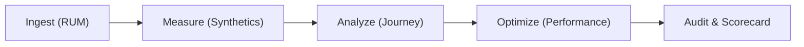
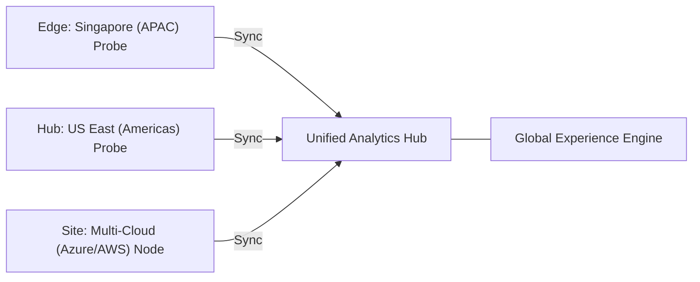
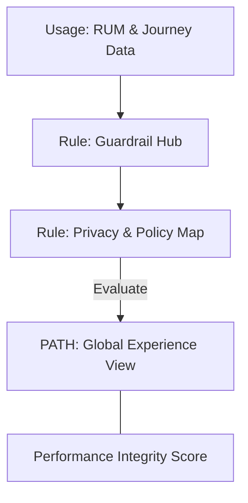
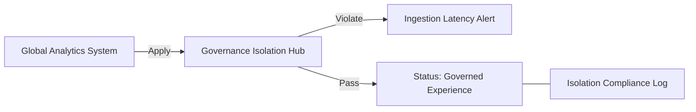
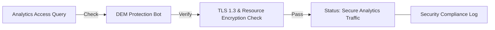
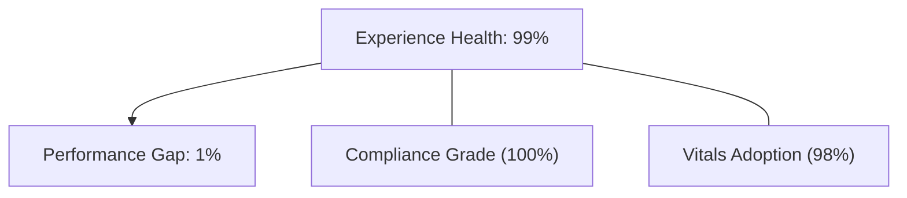
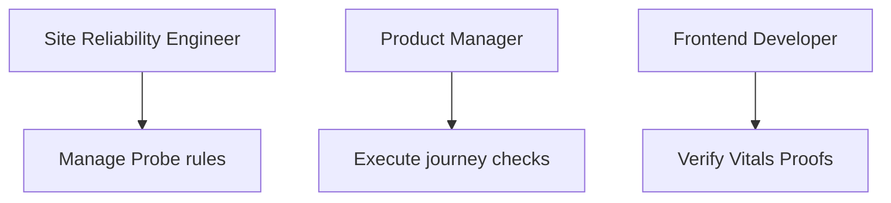
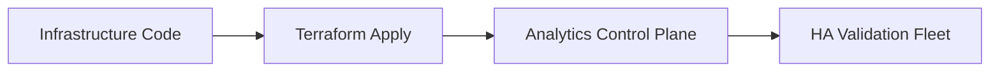
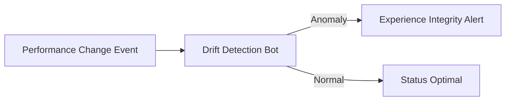
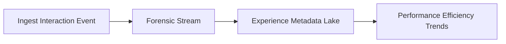

<div align="center">


<h1>Digital Experience Monitoring</h1>

<p><strong>The Institutional-Grade Platform for Standardized Experience Foundations, Monitoring Orchestration Governance, and Multi-Cloud Analytics Ecosystem Delivery.</strong></p>

[]()
[]()
[]()

<br/>

> **"Industrializing telemetry delivery to automate experience foundations."** 
> **Digital Experience Monitoring (DEM)** is an enterprise-grade platform designed to provide a secure, measurable, and highly automated foundation for global digital performance operations. It orchestrates the complex lifecycle of user experience—from RUM ingestion and synthetic probes to journey transformation and unified experience auditing.

</div>

---

## 🏛️ Executive Summary

Fragmented telemetry silos and manual performance workflows are strategic operational liabilities; lack of centralized monitoring orchestration is a primary barrier to organizational cloud maturity. Organizations fail to maintain a secure experience foundation not because of a lack of tools, but because of fragmented analytics standards, lack of automated performance validation, and an inability to orchestrate monitoring planes with operational precision.

This platform provides the **Analytics Intelligence Plane**. It implements a complete **DEM-as-Code Framework**, enabling SRE and Product teams to manage global experience foundations as first-class citizens. By automating the identification of performance bottlenecks through real-time telemetry analysis and orchestrating the deployment of secure performance-driven probe policies, we ensure that every organizational service—from core web vitals to complex API journeys—is governed by default, audited for history, and strictly aligned with institutional experience frameworks.

---

## 📐 Architecture Storytelling: Principal Reference Models

### 1. Principal Architecture: Global Digital Experience Monitoring & Analytics Intelligence Plane
This diagram illustrates the end-to-end flow from telemetry ingestion and multi-cloud orchestration to performance enforcement, quality validation, and institutional experience auditing.


```mermaid
graph LR
    %% Subgraph Definitions
    subgraph TelemetryIngress["RUM & Synthetic Ingress"]
        direction TB
        EndUsers["Web / Mobile / Device Fleets"]
        Synthetics["Global API Probes / Journey Bots"]
        Integrations["Third-party Analytics / Error Tracking"]
    end

    subgraph IntelligenceEngine["Analytics Intelligence Hub"]
        direction TB
        API["FastAPI Ingestion Gateway"]
        MonitoringOrchestrator["Global Experience & Telemetry Hub"]
        Governance_Hub["Compliance & Privacy Guardrail Hub"]
        AIOps_Validator["Drift & Anomaly Analysis Hub"]
    end

    subgraph OperationsPlane["Distributed Analytics Ecosystem"]
        direction TB
        ManagedLakes["Managed Standardized Analytics Lakes"]
        ActivePipelines["Managed Automated Experience Pipelines"]
        ScorecardSinks["Managed Infrastructure Delivery Hubs"]
    end

    subgraph OperationsHub["Institutional Experience Hub"]
        direction TB
        Scorecard["Experience Maturity Scorecard"]
        Analytics["Journey Flow & Readiness Velocity Stats"]
        Audit["Forensic Experience Metadata Lake"]
    end

    subgraph DevOps["DEM-as-Code Framework"]
        direction TB
        TF["Terraform Monitoring Modules"]
        DriftBot["Experience & Config Drift Validator"]
        ChatOps["Telemetry Operations Hub"]
    end

    %% Flow Arrows
    TelemetryIngress -->|1. Submit Telemetry| API
    API -->|2. Orchestrate Ingestion| MonitoringOrchestrator
    MonitoringOrchestrator -->|3. Apply Privacy Guard| Governance_Hub
    Governance_Hub -->|4. Assess Drift| AIOps_Validator
    
    AIOps_Validator -->|5. Execute Analysis| OperationsPlane
    OperationsPlane -->|6. Notify Status| ChatOps
    API -->|7. Visualize Health| Scorecard
    
    Scorecard -->|8. Track Maturity| Analytics
    Scorecard -->|9. Record Performance| Audit
    
    TF -->|10. Provision Backbone| IntelligenceEngine
    DriftBot -->|11. Inject Performance Risk| MonitoringOrchestrator
    Audit -->|12. Improve Operations| ManagedLakes

    %% Styling
    classDef ingress fill:#f5f5f5,stroke:#616161,stroke-width:2px;
    classDef intel fill:#e8eaf6,stroke:#1a237e,stroke-width:2px;
    classDef operations fill:#e1f5fe,stroke:#01579b,stroke-width:2px;
    classDef ops fill:#ede7f6,stroke:#311b92,stroke-width:2px;
    classDef devops fill:#e8f5e9,stroke:#1b5e20,stroke-width:2px;

    class TelemetryIngress ingress;
    class IntelligenceEngine intel;
    class OperationsPlane operations;
    class OperationsHub ops;
    class DevOps devops;
```

### 2. The Experience Lifecycle Flow
The continuous path of a monitoring platform from initial ingestion (RUM) and measurement (synthetics) to active analysis (journey), optimization (performance), and institutional forensic auditing.


```mermaid
graph LR
    Ingest["Ingest (RUM)"] --> Measure["Measure (Synthetics)"]
    Measure --> Analyze["Analyze (Journey)"]
    Analyze --> Optimize["Optimize (Performance)"]
    Optimize --> Audit["Audit & Scorecard"]
```

### 3. Distributed Monitoring Topology
Strategically orchestrating standardized DEM sites across global cloud regions, diverse edge locations, and multi-cloud targets, providing a unified institutional view of global experience health and operational readiness.


```mermaid
graph LR
    RegionA["Edge: Singapore (APAC) Probe"] -->|Sync| Hub["Unified Analytics Hub"]
    BU["Hub: US East (Americas) Probe"] -->|Sync| Hub
    Cloud["Site: Multi-Cloud (Azure/AWS) Node"] -->|Sync| Hub
    Hub --- Logic["Global Experience Engine"]
```

### 4. Telemetry Governance & High-Trust Data Plane Protection Flow
Executing complex logic for securing the bridge between end-user devices and analytics pipelines, ensuring every organizational identity is verified and every telemetry access is according to institutional privacy standards.


```mermaid
graph TD
    DemData["Usage: RUM & Journey Data"] --> Bridge["Rule: Guardrail Hub"]
    Bridge --> PolicyMap["Rule: Privacy & Policy Map"]
    PolicyMap -->|Evaluate| Context["PATH: Global Experience View"]
    Context --- Estimate["Performance Integrity Score"]
```

### 5. Multi-Region Experience Federation & Governance Flow
Automatically managing unified digital performance standards across global regions and diverse application portfolios, ensuring institutional data residency and privacy boundaries by default.


```mermaid
graph LR
    Org["Global Analytics System"] -->|Apply| Guard["Governance Isolation Hub"]
    Guard -->|Violate| Alert["Ingestion Latency Alert"]
    Guard -->|Pass| Verify["Status: Governed Experience"]
    Verify --- Audit["Isolation Compliance Log"]
```

### 6. Encryption & Perimeter Protection Flow (Experience Standard)
Managing the lifecycle of a telemetry request, automatically enforcing institutional TLS 1.3 and resource encryption standards as required by security policy, ensuring zero-latency security confidence.


```mermaid
graph LR
    TelemetryReq["Analytics Access Query"] -->|Check| Gatekeeper["DEM Protection Bot"]
    Gatekeeper -->|Verify| TLS["TLS 1.3 & Resource Encryption Check"]
    TLS -->|Pass| Admit["Status: Secure Analytics Traffic"]
    Admit --- Audit["Security Compliance Log"]
```

### 7. Institutional Experience Maturity Scorecard
Grading organizational performance based on key indicators: Core Web Vitals Compliance, API Latency Adoption Index, and Global Uptime.


```mermaid
graph TD
    Post["Experience Health: 99%"] --> Risk["Performance Gap: 1%"]
    Post --- C1["Compliance Grade (100%)"]
    Post --- C2["Vitals Adoption (98%)"]
```

### 8. Identity & RBAC for Monitoring Governance
Managing fine-grained access to analytics hubs, provisioning workers, and audit logs between SREs, Product Managers, and Frontend Developers.


```mermaid
graph TD
    SRE["Site Reliability Engineer"] --> Hub["Manage Probe rules"]
    PM["Product Manager"] --> Exec["Execute journey checks"]
    Frontend["Frontend Developer"] --> Audit["Verify Vitals Proofs"]
```

### 9. IaC Deployment: DEM-as-Code Framework
Using modular Terraform to deploy and manage the versioned distribution of the monitoring tracking hubs, policy protection workers, and forensic metadata lakes.


```mermaid
graph LR
    HCL["Infrastructure Code"] --> TF["Terraform Apply"]
    TF --> Engine["Analytics Control Plane"]
    Engine --> Clusters["HA Validation Fleet"]
```

### 10. AIOps Experience Drift & Risk Validation Flow
Using advanced analytics to identify sudden surges in rage clicks, unauthorized latency drops, suspicious configuration drifts, or unusual journey pattern changes that could result in institutional risk.


```mermaid
graph LR
    Drift["Performance Change Event"] --> Analyzer["Drift Detection Bot"]
    Analyzer -->|Anomaly| Alert["Experience Integrity Alert"]
    Analyzer -->|Normal| Pass["Status Optimal"]
```

### 11. Metadata Lake for Forensic Experience Audit
Storing long-term records of every journey event generated (metadata), every security event recorded, and every session replay history for institutional record-keeping, compliance auditing, and post-provisioning forensics.


```mermaid
graph LR
    Provision["Ingest Interaction Event"] --> Stream["Forensic Stream"]
    Stream --> Lake["Experience Metadata Lake"]
    Lake --> Trends["Performance Efficiency Trends"]
```

---

## 🏛️ Core Governance Pillars

1.  **Unified Foundation Coordination**: Maximizing resilience by centralizing all performance measurement through a single institutional plane.
2.  **Automated Telemetry Provisioning**: Eliminating "manual monitoring silos" through proactive orchestration and pattern verification.
3.  **Sequential Journey Intelligence**: Ensuring zero-interruption operations through dependency-aware telemetry-driven analytics engineering.
4.  **Zero-Trust Contract Protection**: Automatically enforcing identity-based access and privacy evaluation across all analytics tiers.
5.  **Autonomous Operations Logic**: Guaranteeing reliability through automated industry-specific performance monitoring runbooks.
6.  **Full Experience Auditability**: Immutable recording of every latency change and analytics provision for institutional forensics.

---

## 🛠️ Technical Stack & Implementation

### Analytics Engine & APIs
*   **Framework**: Python 3.11+ / FastAPI.
*   **Performance Engine**: Custom Python-based logic for multi-cloud telemetry ingestion and DORA-style readiness metrics.
*   **Integrations**: Native connectors for Azure Monitor, AWS CloudWatch, and GCP Operations Suite APIs.
*   **Persistence**: PostgreSQL (Experience Ledger) and Redis (Live Journey State).
*   **Auth Orchestrator**: Federated OIDC/SAML for least-privilege analytics management access.

### Governance Dashboard (UI)
*   **Framework**: React 18 / Vite.
*   **Theme**: Dark, Slate, Indigo (Modern high-fidelity experience aesthetic).
*   **Visualization**: D3.js for journey topologies and Recharts for readiness velocity analytics.

### Infrastructure & DevOps
*   **Runtime**: AWS EKS or Azure Kubernetes Service (AKS) for management plane.
*   **Analytics Hub**: Managed event sourcing for immutable performance security timeline reconstruction.
*   **IaC**: Modular Terraform for deploying the experience landing zone and validation fleet.

---

## 🏗️ IaC Mapping (Module Structure)

| Module | Purpose | Real Services |
| :--- | :--- | :--- |
| **`infrastructure/analytics_hub`** | Central management plane | EKS, PostgreSQL, Redis |
| **`infrastructure/probes`** | Distributed synthetic runners | Azure, AWS, GCP APIs |
| **`infrastructure/ingestion_pipes`** | Telemetry Ingestion Hubs | Webhooks, Lambda |
| **`infrastructure/auditing`** | Forensic experience sinks | S3, Athena, Quicksight |

---

## 🚀 Deployment Guide

### Local Principal Environment
```bash
# Clone the monitoring platform
git clone https://github.com/devopstrio/digital-experience-monitoring.git
cd digital-experience-monitoring

# Configure environment
cp .env.example .env

# Launch the DEM stack
make init

# Trigger a mock telemetry update and automated guardrail validation simulation
make simulate-dem
```

Access the Management Portal at `http://localhost:3000`.

---

## 📜 License
Distributed under the MIT License. See `LICENSE` for more information.

---
<div align="center">
  <p>© 2026 Devopstrio. All rights reserved.</p>
</div>
